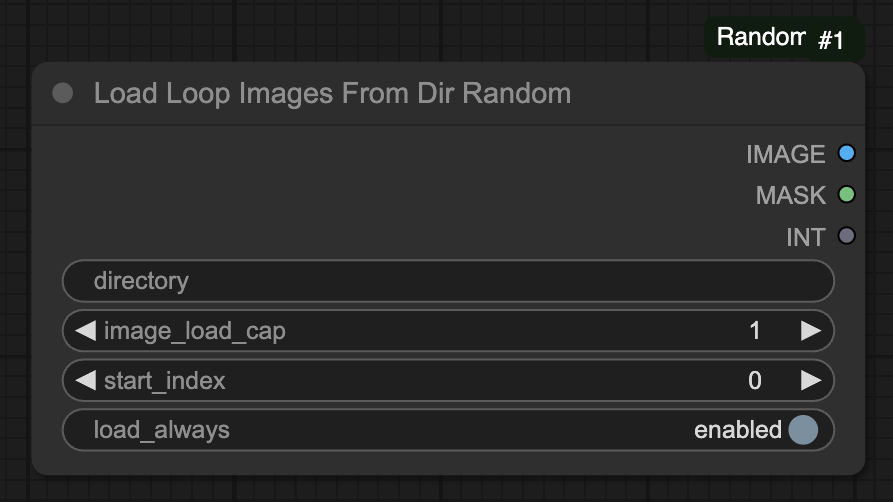

# ComfyUI-RandomList - ComfyUI Node  

A custom node for ComfyUI that provides functionality to load images from a directory with random sampling capabilities.




## 🔹 Features 
- Load multiple images from a specified directory
- Random sampling of images with a configurable cap
- Support for various image formats (JPG, JPEG, PNG, WEBP)
- Optional alpha channel (mask) support
- Configurable start index for sequential loading
- Automatic image resizing to match dimensions
- Option to force reload on every execution

## 🏗 Installation  

1️⃣ **Make sure ComfyUI is installed.**  
2️⃣ Clone this node in the `custom_nodes` folder.  
   ```
   git clone https://github.com/alessandrozonta/ComfyUI-RandomList.git
   ```
3️⃣ Restart ComfyUI.  

## 🔄 Usage

### Node: Load Loop Images From Dir Random

This node allows you to load multiple images from a directory with various configuration options.

#### Inputs

- **directory** (STRING): Path to the directory containing images
- **image_load_cap** (INT, optional): Maximum number of images to load. If set to 0, loads all images. If greater than 0, randomly samples this many images.
- **start_index** (INT, optional): Starting index for sequential loading. Default is 0.
- **load_always** (BOOLEAN, optional): If enabled, forces the node to reload images on every execution.

#### Outputs

- **IMAGE**: The loaded image(s) as a tensor
- **MASK**: The alpha channel mask(s) if available, otherwise a black mask
- **INT**: The number of images loaded

#### Example Workflow

1. Create a directory containing your images
2. Connect the directory path to the node
3. Optionally set an image load cap to randomly sample images
4. Use the output image tensor in your workflow

## Notes

- The node automatically handles different image dimensions by resizing to match
- Images are loaded in RGB format
- If alpha channels are present, they are converted to masks
- The node supports JPG, JPEG, PNG, and WEBP formats
- Images are sorted alphabetically before processing

## 🔧 License & Contributions  

- **License:** GPL-3.0  
- **Contribute:** Open a pull request!  
- **Issues:** Report bugs on GitHub.  